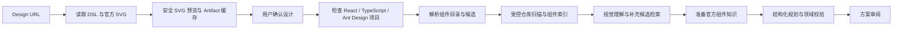

# ui-forge

集成于 VS Code、面向 React + TypeScript 中后台项目的 D2C 智能体实验项目。

当前版本支持设计读取和仓库证据驱动的审阅型规划。用户输入 Design URL 后，系统沿用 MasterGo Magic MCP 读取 DSL 与官方 SVG，在一次检查中复用连接、受限并发读取分段，并生成安全 SVG 预览。用户精确回复“确认设计”后，工作流检查目标项目、识别组件候选并扫描仓库。

百炼均衡预设使用 Qwen3.7-Plus 分别完成视觉理解与方案规划：视觉关闭思考，规划使用有限思考预算；JSON 格式修复使用 Qwen3.8-Flash，业务校验拒绝后可升级 Qwen3.8-Max。程序先准备视觉和官方组件知识，模型以无工具结构化调用返回精简方案；文件汇总和组件汇总由程序生成。正常路径包含一次视觉推理和一次规划推理，补充查询、格式修复、传输重试或业务修正会增加调用次数。旧模型配置保留受控工具规划路径。

反馈修订、Patch、执行验证和交付仍属于后续能力，当前方案不能触发文件写入。

## 当前工作流



## 包边界

- `packages/agent-core`：领域无关的 Agent、受限 Deep Agent 与 LangGraph 封装。
- `packages/d2c-agent`：D2C 任务、设计与项目检查领域端口、平台无关候选证据、视觉 Subagent、主 Plan Agent、Graph 和对外 D2C Service。
- `packages/d2c-storage`：设计 Artifact 文件存储；不保存任务状态。
- `packages/mastergo-adapter`：实时 MasterGo MCP、脱敏 Fixture，以及 MasterGo DSL 到平台无关节点结构的适配。
- `packages/design-system-adapter`：Design Token、Ant Design 主题适配，以及官方 CLI stdio MCP 的版本化组件知识 Adapter。
- `packages/component-indexer`：目标项目的受控检查，以及基于 TypeScript AST 的组件、样式引用、消费者和检索证据提取。
- `packages/shared-protocol`：Server 与客户端之间的快照、命令和有序事件流 Schema。
- `apps/agent-server`：协议分发、快照投影与依赖装配。
- `apps/agent-webview`：在单一对话视图中完成 Design URL 输入、设计读取状态、右侧 SVG 检查、确定性口令确认、项目校验和方案审阅。
- `apps/vscode-extension`：VS Code Activity Bar 入口、任务面板承载与 Agent Server 通信转发。

D2C Service 是对外业务入口，负责命令、revision 和 Artifact 生命周期；D2C Graph 只负责节点拓扑与状态转换。每个 Service 复用同一个编译 Graph，不为不同任务或命令重复创建 Graph。

`packages/d2c-agent/src/planning` 已提供独立但尚未接入当前 Graph 的可演进 Plan 领域基础：人工确认的布局、组件和交互字段可以锁定，后续代码阶段只能通过版本化 `PlanDelta` 调整未锁字段和执行细节；受影响步骤的旧 Patch 绑定会失效，锁冲突必须返回人工决定。该基础不会让当前审阅页面产生 Patch 或执行代码。

## 安全约束

- Agent Server 仅允许监听 localhost、IPv4 loopback 或 IPv6 loopback；当前版本不支持局域网或公网部署，`UI_FORGE_HOST` 配置为非回环地址时启动会直接失败。
- MasterGo 输出视为不可信输入；SVG 预览拒绝脚本、事件处理器、`foreignObject`、样式表和外部资源。
- 目标项目检查只读取根目录最小工程证据，不向模型开放任意 Shell 或文件系统访问；对客户端裁剪绝对路径和原始清单。
- 原始设计数据保存在独立 Artifact 中，Checkpoint 只持有轻量引用；未绑定、已放弃或被替代的 Artifact 会按配置回收。
- 候选提取节点只消费受限的平台无关节点证据，不向模型发送原始设计 JSON；视觉 Subagent 仅接收压缩候选、含有限文本的结构摘要、受控整体 PNG 和候选裁剪图，结构超限或图片不可用时明确降级。静态稿交互只能标记为推断或未解决，未解决交互不能进入实施步骤。
- 仓库分析只读取任务绑定目录中的有限普通文件，忽略依赖、构建目录和符号链接；模型只能引用扫描到的既有文件或安全的新建相对路径。当前不渲染仓库组件，因此不会把结构匹配宣称为像素级一致。
- 工作流保留用户取消，结构化方案修正最多三轮；对话栏展示各阶段耗时、Ant Design MCP 查询和模型返回的 Token 用量，用户可随时终止当前分析，取消信号会贯穿目录查询、仓库分析、视觉证据和模型调用。Tool 提示、视觉建议、官方组件知识、最终类型和选择原因分别保留，最终语义由主 Agent 决策。
- Ant Design MCP 使用本地安装的官方 CLI 和打包元数据，不在运行时调用 `npx`；目标项目目录用于自动识别 antd 版本，更新检查和自动问题上报保持关闭。目录查询失败时显式降级，缺少官方查询证据时不得声称复用 Ant Design 组件。
- 组件语义不复用 MasterGo 的 `COMPONENT`/`INSTANCE` 节点角色。人工目录提供业务别名和子组件映射，并与官方 MCP 清单合并；目录别名只作为提示，不声明符合某种 MasterGo 标准画法。

## 本地运行

```bash
npm install
npm run check
npm run build
npm run dev:server
npm run dev:webview
```

在 VS Code 的“运行和调试”中启动 `ui-forge: Server + VS Code`，然后从 Activity Bar 打开 ui-forge；可通过视图标题栏中的“创建任务”按钮进入任务设置页面。

复制 `.env.example` 为 `.env`。实时 MasterGo 读取需要 `MG_MCP_TOKEN`；新配置使用 `.env.example` 中的 `MODEL_PROFILE=bailian-balanced` 和 `MODEL_API_KEY`；视觉、规划、格式修复及升级模型可分别覆盖。未设置预设时继续兼容原有 `MODEL_PROVIDER`、`MODEL_NAME`、`MODEL_API_KEY`、`MODEL_BASE_URL`。完整参数、DeepSeek 对照配置和评测方法见 [百炼模型与性能配置](apps/agent-server/MODELS.md)。`UI_FORGE_COMPONENT_CATALOG_PATH` 可指向由 Server 启动者管理并通过 Schema 校验的人工组件目录 JSON；运行时会将其与目标版本的官方 Ant Design MCP 清单合并。`DATABASE_URL` 用于持久化 LangGraph Checkpoint；原始设计 Artifact 默认写入 `.ui-forge/artifacts`。

无需在线 MasterGo 的本地联调可设置：

```dotenv
UI_FORGE_DESIGN_PROVIDER=mastergo-fixture
```

界面可以填写普通 MasterGo 引用，也可以使用固定引用 `table-filter`。Fixture 只读取仓库明确登记的脱敏样本，不把客户端输入解释为本地路径。

## 后续占位方向

- 更完整的 Design Token 语义匹配与仓库组件渲染比较
- 用户反馈驱动的方案修订
- 可审批 Patch 与受控写入
- 构建、页面渲染和视觉验证

这些能力在真正实现前不会以静态方案或演示数据伪装为可用结果。
