# ui-forge

集成于 VS Code、面向 React + TypeScript 中后台项目的 D2C 智能体实验项目。

当前版本跑通设计读取、仓库证据驱动的审阅型规划，以及分阶段授权的受控交付：用户在单一对话视图中输入 Design URL，系统读取并缓存 MasterGo 设计上下文，从官方矢量与布局数据确定性合成安全 SVG 预览。用户检查右侧预览并在对话中精确回复“确认设计”后，Graph 首先确定性检查目标项目；不支持的项目立即结束，空目录进入初始化规划，React + Ant Design 项目继续生成组件候选并受控扫描源码。主 Plan Agent 委派独立视觉 Subagent 形成布局、组件、可见元素、静态状态和交互理解，再结合仓库与设计系统证据生成复用决策、文件影响、验收路由及原子实施步骤。Graph 在 Plan 后再次暂停；用户批准精确 `planVersion + planHash` 后，系统只获得生成候选 Patch 和安全落盘的授权。Patch 落盘后，系统才解析并展示将以 `shell=false` 执行的真实 `cwd + executable + argv`，将它们与 Patch、Workspace 和命令计划哈希绑定，再等待独立批准。只有命令目录位于当前 VS Code Workspace 内且命令满足白名单时才提供批准入口；目录外或无法安全解析的命令只能由人工复制执行。批准后系统可按精确计划安装缺失的 npm 或 pnpm 依赖、执行受限 Vite 构建、loopback 页面预览、Playwright 截图和像素差异验收；全部通过后进入可交付状态。生成、应用或验收遇到问题时停止继续推进并保留文件、命令生命周期日志和截图证据，转由人工处理。任务 Checkpoint 默认持久化到本地 SQLite，VS Code 侧边栏按“待你处理、可继续、已完成、已归档”展示当前 Workspace 任务，并支持一次确认后永久删除；重新打开只恢复权威中间态，用户点击继续后才执行后续操作。反馈修订和自动修复仍属于后续能力。

## 当前工作流

```mermaid
flowchart LR
    A[输入 Design URL] --> B[读取并标准化设计上下文]
    B --> P[直接提取官方矢量并合成高还原预览]
    P --> C[缓存大型设计 Artifact]
    C --> D[右侧默认展开安全 SVG 预览]
    D --> E[用户精确回复确认设计]
    E --> G[确定性检查目标项目]
    G -->|空目录| H[记录后续初始化项目步骤]
    G -->|React + Ant Design| I[通过项目支持校验]
    G -->|其他项目| J[终止并提示不支持]
    H --> A[通过官方 Ant Design MCP 解析版本化组件目录]
    I --> A
    A --> K[生成平台无关组件候选]
    K --> R[受控扫描仓库组件与依赖]
    R --> L[主 Plan Agent 委派视觉 Subagent]
    L --> M[理解组件、布局、可见元素与静态状态]
    M --> O[提升高置信度遗漏组件候选]
    O --> S{存在视觉补充候选}
    S -->|是| T[受控增量检索补充候选]
    S -->|否| Q[查询候选组件 API、语义结构、Token 与示例]
    T --> Q
    Q --> N[受控提交并校验复用决策、文件影响与原子步骤]
    N --> U[用户授权当前 Plan 的生成与应用]
    U --> V[重新读取计划文件并校验版本与路径]
    V --> W[受限 Code Agent 逐步骤生成完整文件变换]
    W --> X[绑定 Plan、Patch 与文件哈希]
    X --> Y[全量预检目标路径与 beforeHash]
    Y -->|通过| Z[暂存并受控创建、修改或删除文件]
    Y -->|异常| R1[停止写入并转人工]
    Z --> R2[展示审计 Diff 与写入文件清单]
    R2 --> C1[解析并展示真实 cwd、executable 与 argv]
    C1 --> C2{命令目录位于当前 Workspace 且满足白名单}
    C2 -->|否| R4[仅提示人工执行]
    C2 -->|是| C3[用户按 Command plan hash 独立批准]
    C3 --> B0[按需执行禁用生命周期脚本的 npm 或 pnpm 安装]
    B0 -->|通过| B1[执行白名单 Vite 构建]
    B0 -->|失败| R3
    B1 -->|通过| B2[启动 loopback 预览并截取验收路由]
    B1 -->|失败| R3[保留日志并转人工]
    B2 -->|通过| B3[与设计预览执行像素差异门禁]
    B2 -->|失败| R3
    B3 -->|通过| B4[进入可交付状态]
    B3 -->|失败| R3[保留实际截图和差异图并转人工]
```



## 包边界

- `packages/agent-core`：领域无关的 Agent、受限 Deep Agent 与 LangGraph 封装。
- `packages/d2c-agent`：D2C 任务、设计与项目检查领域端口、版本化 Plan、视觉 Subagent、主 Plan Agent、受限 Code Agent、结构化 Patch、受控应用与交付验收端口、Graph 和对外 D2C Service。
- `packages/d2c-storage`：设计 Artifact 与交付截图证据的文件存储；不保存任务状态。
- `packages/mastergo-adapter`：实时 MasterGo MCP、脱敏 Fixture，以及 MasterGo DSL 到平台无关节点结构的适配。
- `packages/design-system-adapter`：Design Token、Ant Design 主题适配，以及官方 CLI stdio MCP 的版本化组件知识 Adapter。
- `packages/component-indexer`：目标项目的受控检查、组件检索证据提取，以及代码阶段带路径、符号链接、大小和内容哈希门禁的文本快照读取。
- `packages/tools`：受控工具契约、带路径与哈希门禁的 Workspace Patch 应用器，以及白名单构建、loopback Vite 预览和 Playwright 截图验收器。
- `packages/visual-evaluator`：对设计预览和页面截图执行归一化与像素差异评测。
- `packages/shared-protocol`：Server 与客户端之间的快照、命令和有序事件流 Schema。
- `apps/agent-server`：协议分发、快照与任务摘要投影、SQLite/PostgreSQL Checkpointer 及依赖装配。
- `apps/agent-webview`：在单一对话视图中完成 Design URL 输入、SVG 检查、项目校验、方案审阅、Plan 写入授权、真实命令独立授权、构建、页面渲染与视觉验收，并展示审计 Diff、命令和图片证据。
- `apps/vscode-extension`：VS Code Activity Bar 入口、按处理语义分类的 Workspace 任务树、任务管理命令、任务面板承载与 Agent Server 通信转发。

D2C Service 是对外业务入口，负责命令、revision、Artifact 生命周期，以及 Graph 结束后的确定性 Patch 应用和交付验收；D2C Graph 只负责节点拓扑与 Agent 状态转换。每个 Service 复用同一个编译 Graph，不为不同任务或命令重复创建 Graph。

`packages/d2c-agent/src/planning` 通过 `planVersion` 与 `planHash` 把人工批准和候选 Patch 绑定到精确 Plan 内容；每个步骤 Patch 还记录变换前后的文件内容哈希。未来通过 `PlanDelta` 调整计划时，受影响步骤的旧 Patch 绑定会失效，人工锁冲突必须返回人工决定。

## 安全约束

- Agent Server 仅允许监听 localhost、IPv4 loopback 或 IPv6 loopback；当前版本不支持局域网或公网部署，`UI_FORGE_HOST` 配置为非回环地址时启动会直接失败。
- MasterGo 输出视为不可信输入；SVG 预览拒绝脚本、事件处理器、`foreignObject`、样式表和外部资源。
- 目标项目检查只读取根目录最小工程证据，不向模型开放任意 Shell 或文件系统访问；对客户端裁剪绝对路径和原始清单。
- 原始设计数据保存在独立 Artifact 中，Checkpoint 只持有轻量引用；未绑定、已放弃或被替代的 Artifact 会按配置回收。
- 候选提取节点只消费受限的平台无关节点证据，不向模型发送原始设计 JSON；视觉 Subagent 仅接收压缩候选、含有限文本的结构摘要、受控整体 PNG 和候选裁剪图，结构超限或图片不可用时明确降级。静态稿交互只能标记为推断或未解决，未解决交互不能进入实施步骤。
- 视觉 Subagent 的结构化结果除 Schema 外还必须通过任务绑定的候选、节点、布局和目录语义校验；首次语义失败只允许使用相同受控证据执行一次隔离纠正，再次失败立即停止。安全日志只记录校验阶段、稳定错误码和规则名，不保存模型响应或设计内容。
- 仓库分析只读取任务绑定目录中的有限普通文件，忽略依赖、构建目录和符号链接；模型只能引用扫描到的既有文件或安全的新建相对路径。当前不渲染仓库组件，因此不会把结构匹配宣称为像素级一致。
- Code Agent 不拥有文件系统、Shell、网络、写入或子 Agent 能力；只有当前 Plan 的版本与内容哈希已被显式批准时才能启动，并且只能读取工作流提供的计划文件和明确复用参考文件快照。代码生成前重新校验规范化路径、真实路径、符号链接、文件类型、内容大小和 SHA-256，输出必须逐步骤匹配 Plan 的路径与动作。
- 公开快照只包含审计 Diff、哈希和相对文件动作，不包含待写入的完整内部 Patch 内容。用户一次授权精确 Plan 的生成与应用后，完整 Patch 仍只在服务端内部流转；应用器重新检查规范路径、真实路径、符号链接、`beforeHash` 与生成内容 `afterHash`，全量预检通过后才会暂存和提交。提交失败会反向恢复已触碰文件；恢复不完整时保留隔离数据并明确要求人工处理。
- Plan 批准不授权任何尚未生成的命令。Patch 落盘后，命令计划以真实 `cwd`、`executable`、`argv`、超时、网络策略、Patch 哈希和 Workspace realpath 计算 SHA-256；展示字符串与实际 `spawn` 参数来自同一结构，执行前还会重新解析当前项目并逐字段比对白名单。
- 自动命令只允许在当前 VS Code Workspace 的真实目录内执行；即使两个目录使用同一 Git remote，也不会共享命令授权范围。目录外计划、npm/pnpm 之外的包管理器、非固定构建脚本或无法解析的运行时都只返回人工操作说明，不提供批准入口。缺少本地 TypeScript/Vite 时可在独立命令批准后执行精确安装：npm 显式包含开发依赖并把缓存写入项目内 `.ui-forge/npm-cache`；pnpm 显式包含开发依赖、禁用生命周期脚本与 `.pnpmfile.cjs` hooks，并把 store 写入 `.ui-forge/pnpm-store`。
- 构建和预览只运行项目内 TypeScript/Vite CLI，不执行模型生成的 Shell 或包管理器生命周期脚本。子进程使用 `shell=false`、项目内私有 HOME 和去除模型、设计、认证及代理配置的最小环境；预览仅绑定 `127.0.0.1`，Playwright 禁用 Service Worker、拦截外部 HTTP 与 WebSocket 请求，并在限定时长后终止进程。
- 命令日志按任务记录 `proposed`、`approved`、`started`、`completed` 和 `blocked`，包含精确命令字段与稳定失败码，不保存环境变量、认证信息或完整输出。页面截图、像素差异图和日志通过任务绑定的证据引用按需读取，不直接塞入任务快照。视觉差异比例默认不得超过 10%，可通过受限环境配置调整；构建、渲染或视觉门禁失败时保留当前文件与证据并进入人工处理状态，重试时重新准备并批准命令计划，但不会再次要求批准未变化的 Plan。
- 主 Plan Agent 不设固定运行时限；对话栏展示各阶段耗时、Ant Design MCP 查询和模型返回的 Token 用量，用户可随时终止当前分析，取消信号会贯穿目录查询、仓库分析、视觉证据和模型调用。Tool 提示、视觉建议、官方组件知识、最终类型和选择原因分别保留，最终语义由主 Agent 决策。
- Ant Design MCP 使用本地安装的官方 CLI 和打包元数据，不在运行时调用 `npx`；目标项目目录用于自动识别 antd 版本，更新检查和自动问题上报保持关闭。目录查询失败时显式降级，缺少官方查询证据时不得声称复用 Ant Design 组件。
- 组件语义不复用 MasterGo 的 `COMPONENT`/`INSTANCE` 节点角色。人工目录提供业务别名和子组件映射，并与官方 MCP 清单合并；目录别名只作为提示，不声明符合某种 MasterGo 标准画法。

## 本地运行

```bash
npm install
npm run check
npm run build
npm run dev:server
npm run dev:webview
```

在 VS Code 的“运行和调试”中启动 `ui-forge: Server + VS Code`，然后从 Activity Bar 打开 ui-forge；视图标题栏中的“创建任务”按钮会直接创建并打开一个带时间临时名称的任务，成功读取设计后自动改为“设计名称 · 区域名称”。人工重命名始终优先；也可从分类任务列表打开、重命名、归档、恢复或永久删除任务。删除按钮只确认一次，确认后会移除任务及全部中间状态且无法恢复；恢复任务不会自动启动分析、生成或验收，需由用户点击对应继续操作。

复制 `.env.example` 为 `.env`。实时 MasterGo 读取需要 `MG_MCP_TOKEN`；模型配置使用 `MODEL_PROVIDER`、`MODEL_NAME`、`MODEL_API_KEY` 和可选的 `MODEL_BASE_URL`。结构化响应默认采用兼容 thinking mode 的 `MODEL_STRUCTURED_OUTPUT_MODE=json-text`，明确支持强制工具选择的模型可改为 `tool`。`UI_FORGE_COMPONENT_CATALOG_PATH` 可指向由 Server 启动者管理并通过 Schema 校验的人工组件目录 JSON；运行时会将其与目标版本的官方 Ant Design MCP 清单合并。Checkpoint 默认使用 `UI_FORGE_CHECKPOINT_BACKEND=sqlite` 写入 `.ui-forge/runtime/checkpoints.sqlite`；需要共享数据库时改为 `postgres` 并配置 `DATABASE_URL`。原始设计 Artifact 和任务绑定的交付证据默认写入 `.ui-forge/artifacts`。`UI_FORGE_VISUAL_DIFF_THRESHOLD` 可在 `0` 到 `1` 之间调整视觉差异比例门禁，默认值为 `0.1`。

无需在线 MasterGo 的本地联调可设置：

```dotenv
UI_FORGE_DESIGN_PROVIDER=mastergo-fixture
```

界面可以填写普通 MasterGo 引用，也可以使用固定引用 `table-filter`。Fixture 只读取仓库明确登记的脱敏样本，不把客户端输入解释为本地路径。

## 后续占位方向

- 更完整的 Design Token 语义匹配与仓库组件渲染比较
- 用户反馈驱动的方案修订
- 验收失败后的受限自动修复，以及多路由交付验收

这些能力在真正实现前不会以静态方案或演示数据伪装为可用结果。
